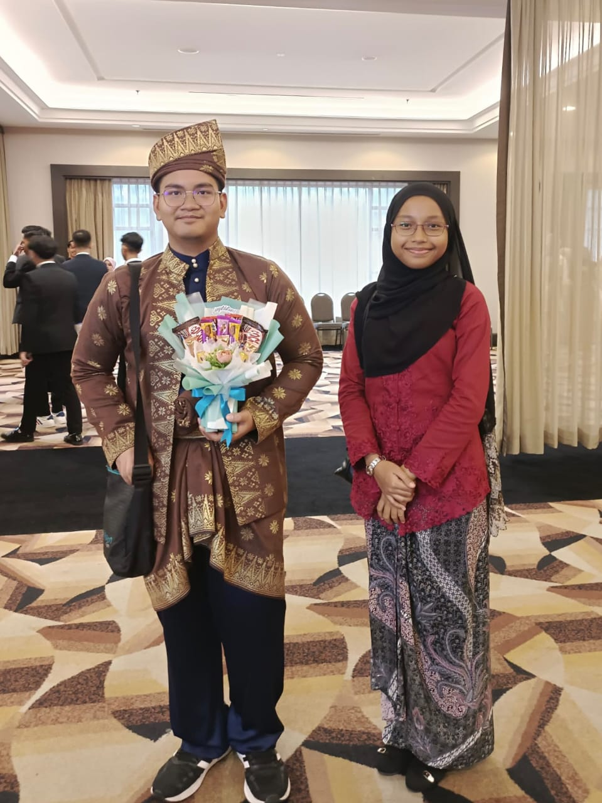
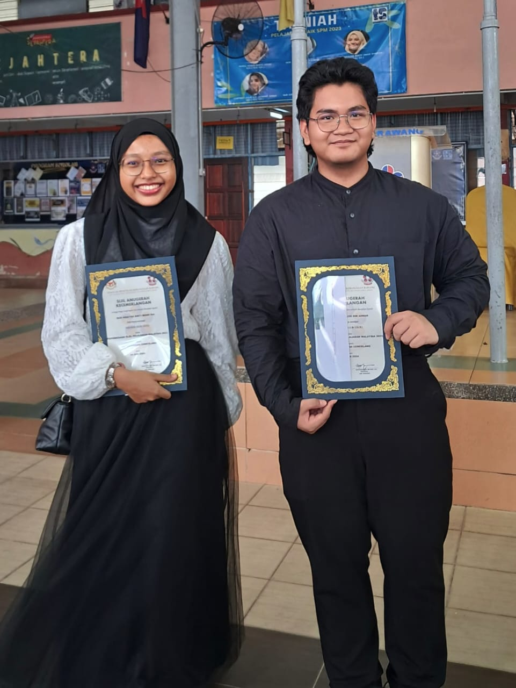
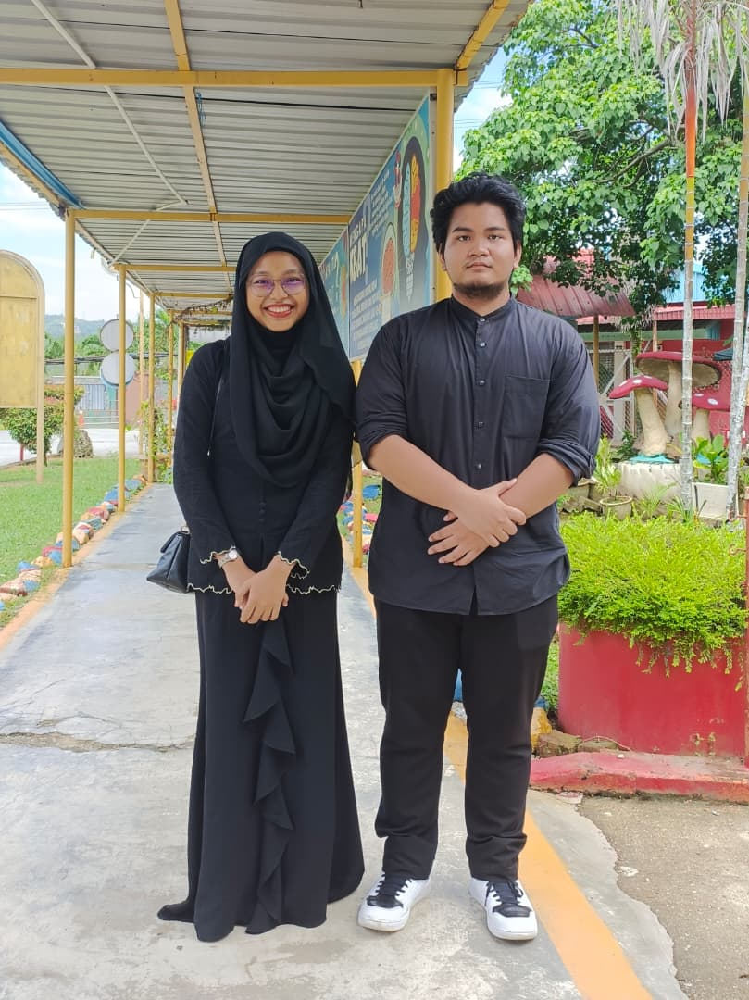
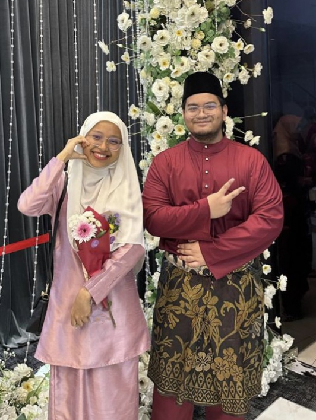

<html lang="ms">
<head>
    <meta charset="UTF-8">
    <meta name="viewport" content="width=device-width, initial-scale=1.0">
    <title>Untuk Azri Kesayanganku ❤️</title>

    

</head>

<body>

    <h1>MUHAMMAD AZRI BIN ADNAN ❤️</h1>

    <!-- 4 GAMBAR -->
    

        
        
        
        
    

    <audio controls autoplay>
	  <source src="lagu.mp3" type="audio/mpeg">
	</audio>

    <!-- LOVE LETTER -->
    

Aslm Azri,
	
Ini ada hadiah ringkas daripada aku untuk kau. Hehehe... <i>simple</i> je aku buat ni, tak adalah sehebat mana kalau nak dibandingkan dengan bunga yang kau bagi sebelum ni. <i>Sorry</i> tau kalau ia nampak biasa-biasa je, tapi yang luar biasa tu ada dalam surat cinta ni. HAHAHAHHA!

<b>Buat Azri Sayang,</b>

Terlebih dahulu, aku nak ucapkan terima kasih sebab sudi jadi teman lelaki dan insya-Allah, bakal suami aku satu hari nanti. <i>I love you so much from the bottom of my heart.</i> Terima kasih juga sebab selalu sabar melayan segala karenah aku yang "tak betul" ni. Hehehe. Aku janji, lepas ni aku tak nakal lagi, <i>serious</i> seyes seyes!

Aku sangat hargai kehadiran kau dalam hidup aku. Sepanjang aku hidup, aku tak pernah jumpa lelaki yang sangat <i>amazing</i> macam kau. Aku hargai setiap usaha kau untuk buat aku bahagia, walaupun ia sekecil zarah. Paling aku terharu, bila tengok kau berusaha ubah diri dan cuba jadi manusia yang terbaik. Bagi aku, kau sebenarnya dah sampai ke tahap itu. <i>I’m really proud of you.</i> Aku suka sangat lawak kau, selalu buat aku terhibur. <i>You are literally the smartest, handsomest, kindest, and most loyal man I’ve ever known.</i> Kau dah cukup sempurna di mata aku.

Selain tu, aku nak minta maaf sangat kalau aku ada buat kau rasa tertekan dengan "overthinking" aku sebelum ni. Kadang-kadang aku terlampau fikir yang bukan-bukan sampai aku lupa betapa besarnya usaha kau untuk jaga hati aku. Terima kasih sebab tak pernah jemu yakinkan aku bila aku tengah <i>down</i>.

Kalau kau ada sebarang masalah, tolong jangan pendam sorang-sorang ya? Luahkanlah pada aku, aku sentiasa sudi mendengar. Aku tak nak kau stres sebab ia boleh beri kesan pada <i>mental health</i> kau. Aku sangat <i>caring</i> sebab aku terlalu sayangkan kau.

Kau tahu kan betapa aku nak sangat jadi isteri kau satu hari nanti? Aku juga tengah berusaha jadi yang terbaik, bukan saja untuk diri sendiri tapi untuk masa depan kita berdua. Aku harap sangat LDR kita ni berakhir dengan <i>happy ending</i>—iaitu kita duduk serumah. Aku akan cuba sedaya upaya untuk buat kau jadi <i>the happiest man in the world.</i>.Aku sanggup tunggu kau jika aku adalah tujuan terakhir kau.

Kita dah lalui banyak cabaran sebelum ni, dan Alhamdulillah kita masih kekal bersama.Aku akan selalu ada dengan kau waktu susah dansenang,gagal dan berjaya .Semoga hubungan kita sampai ke syurga. Perasaan aku terhadap kau takkan pudar dan aku sayang kau selama-lamanya. Aku tahu kita saling berdoa menyebut nama sesama sendiri setiap hari. Aku selalu, setiap kali solat 5 waktu, takkan pernah terlepas doa untuk kau di akhir sujud, waktu antara azan dan iqamah, serta waktu hujan. Tapi kau tak boleh tahu ler ayat aku doa macam mana KWKWKWKWKWK

Insya-Allah, bila sampai masanya nanti, akulah yang akan jadi sahabat dan isteri yang taat pada kau. Kalau boleh, aku nak target kita kahwin tahun 2030 atau 2033 sebab tarikh tu cantik HAHAHAHA. Cane ek mini version of us nanti hmmm,Ada 4-5 orang ke HAHAHAH.Kalau aku ada buat silap atau terkasar bahasa sebelum ni, aku minta maaf sangat-sangat. Aku tahu aku banyak buat silap tapi kau tetap ada. Kau adalah <i>first love</i> aku yang paling <i>real</i>. Aku sangat beruntung dapat kau. Inilah luahan hati aku yang sejujurnya. Masa tengah taip ni pun, aku rasa macam ada rama-rama tengah terbang dalam perut ni! HEHEHEH 🦋 

        

            Sincerely, 
            Hidayah (Your Future Wife) 💍
        

    

</body>
</html>
